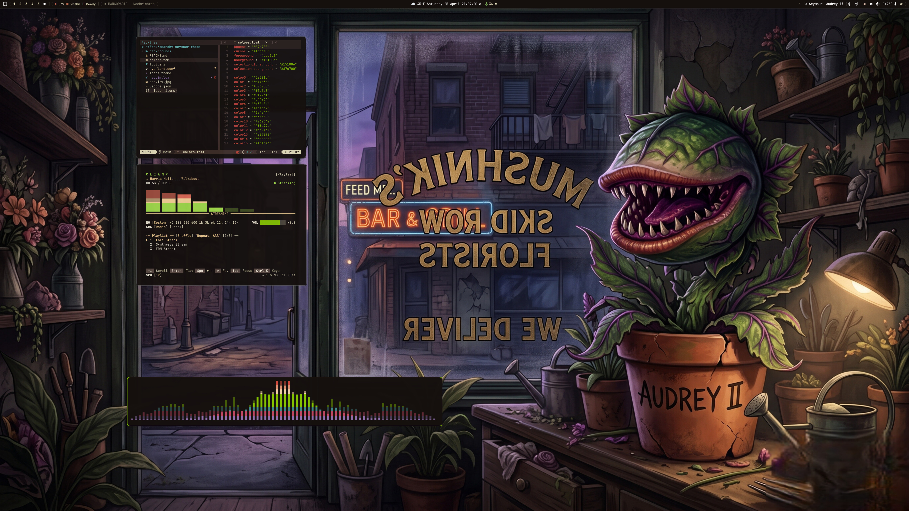
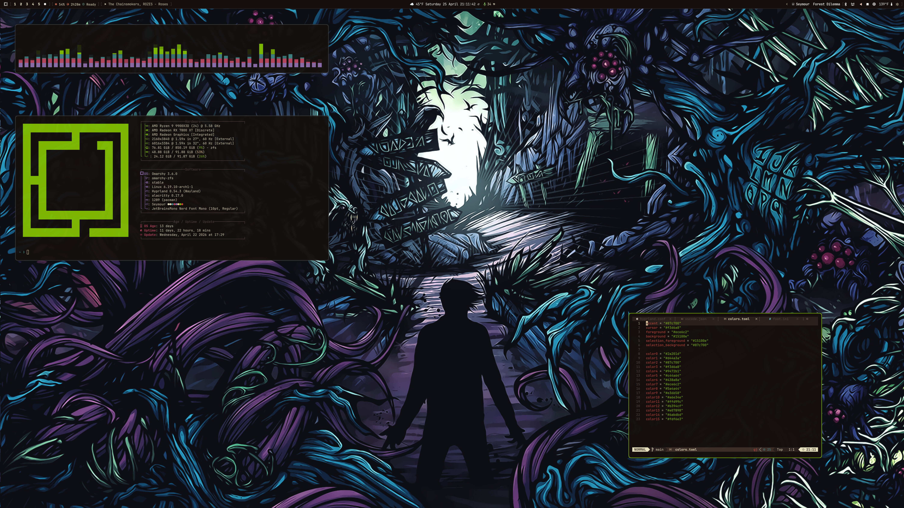

# Seymour

An [Omarchy](https://omarchy.org) theme inspired by *Little Shop of Horrors* — Audrey II green on deep ink, with cream, blood-red, and lavender accents.




## Install

```sh
omarchy-theme-install https://github.com/peteonrails/omarchy-seymour-theme
```

Then activate via the theme menu (`SUPER + CTRL + SHIFT + SPACE`) or:

```sh
omarchy-theme-set seymour
```

## Palette

| Role | Color |
| --- | --- |
| Background | `#15100e` |
| Foreground | `#ece6c2` |
| Accent | `#87c700` |
| Cursor | `#f3d6a8` |
| Red | `#d44a3a` |
| Lavender | `#9472b1` |
| Magenta | `#c44a64` |
| Teal | `#438a8a` |

## What's included

- `colors.toml` — palette consumed by Omarchy's auto-template system (alacritty, kitty, ghostty, hyprland, hyprlock, mako, walker, waybar, btop, swayosd, chromium, keyboard)
- `foot.ini` — hand-rolled foot terminal colors
- `neovim.lua` — [everforest](https://github.com/neanias/everforest-nvim) (hard background)
- `vscode.json` — Everforest Dark
- `icons.theme` — Yaru-olive
- `backgrounds/` — `Audrey-II.jpg` and `Forest-Dilemma.jpg`

## Credits

- Inspired by the 1986 film *Little Shop of Horrors* (and the 1982 Howard Ashman / Alan Menken stage musical).
- `Audrey-II.jpg` by [@peteonrails](https://github.com/peteonrails).
- `Forest-Dilemma.jpg` from [wallhaven.cc/w/l3mom2](https://wallhaven.cc/w/l3mom2).
